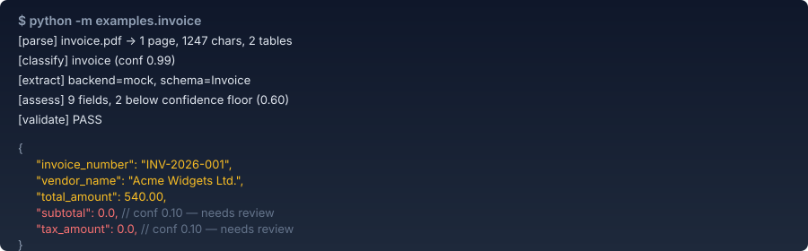
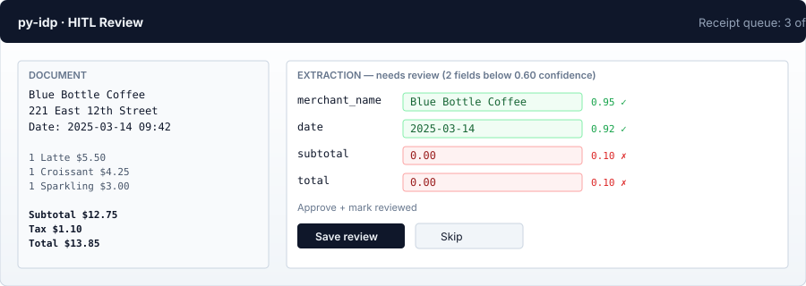

# py-idp

> **以 Python 為基礎的通用 AI 智慧文件處理框架。**
> 六階段管線（parse → classify → extract → assess → validate → HITL）。
> 支援 12+ 種 LLM 後端。以 Pydantic Schema 為驅動。內建評測工具組。
> **自動分塊處理超大文件。透過 Nanonets-OCR2-3B 實現自架 OCR。AI 驅動的 Schema 自動探索。**

**語言:** [English](README.md) · [繁體中文](README.zh-TW.md) · [简体中文](README.zh-CN.md)

[](LICENSE-AGPL)
[](LICENSE-COMMERCIAL)
[](https://www.python.org/)
[](https://github.com/rollroyces/py-idp/actions/workflows/tests.yml)
[](https://pypi.org/project/py-idp/)
[](https://pypistats.org/packages/py-idp)
[](https://github.com/rollroyces/py-idp/stargazers)
[](CITATION.cff)

---

## 安裝

```bash
pip install py-idp                # 核心套件（pydantic + typer + rich + httpx + pdfplumber）
pip install py-idp[docling]      # IBM Docling —— 最佳的 PDF 表格抽取
pip install py-idp[openai]       # OpenAI SDK（同時用於 8 個中國 LLM）
pip install py-idp[anthropic]    # Anthropic SDK
pip install py-idp[api]           # FastAPI 伺服器（idp.api:app，生產可用）
pip install py-idp[hf-vlm]        # 自架 Nanonets-OCR2-3B（Apple Silicon / CUDA）
pip install py-idp[dev]          # pytest + ruff + mypy
```

> 安裝與執行測試套件皆無需 API Key——`MockBackend` 已內建。
> `tiktoken` 由核心套件自動安裝（用於以 token 預算為基礎的分塊）。

---

## 30 秒快速上手

```python
import idp
from idp.pipeline import Pipeline

result = Pipeline(
    backend="mock",                # 或 "ollama"、"openai"、"anthropic"、"china:qwen" 等
    schema="Invoice",
    business_rules=[...],
).run(idp.Document.from_path("invoice.pdf"))

print(result.extraction)    # dict —— 已根據你的 Pydantic Schema 驗證
print(result.confidence)    # dict —— 每個欄位 0..1，<0.6 將標記為待複核
print(result.validation)    # dict —— Schema 與業務規則驗證結果
```

**在內建範例發票上的端對端實測：**

| 指標 | 值 |
|---|---|
| 文件分類 | `invoice`（信心度 0.99） |
| 抽取欄位規模 | 12 個欄位，2 個明細項目 |
| 驗證 | 通過 |
| 與 gold 的欄位精確匹配率 | **7 / 9 = 78 %**（單一文件） |
| 低信心度標記（HITL） | 2 個（subtotal、tax_amount——小模型算術錯誤） |
| 延遲（模擬 LLM） | < 2 ms |

**完整評測套件，3 張發票，本地真實 Ollama（`qwen2.5:0.5b`，397 MB）：**

| 指標 | 值 |
|---|---|
| Schema 合法率 | **100 %**（3 / 3） |
| 欄位 F1 | **0.96**（精確率 1.00，召回率 0.93） |
| 延遲 | **2.05 s / 文件**（Apple Silicon） |
| 單文件精確匹配 | inv-001 7/9 · inv-002 9/9 · inv-003 9/9 |

框架對小型模型的弱點是誠實的：小模型在算術運算上（`subtotal` / `tax_amount`）的信心度為 0.10，會被路由到 HITL 複核，而不是靜默放行。

---

## 管線

```text
INGEST  →  PARSE  →  CLASSIFY  →  ROUTE  →  EXTRACT  →  ASSESS  →  VALIDATE  →  HITL
                                                                         (Streamlit)
```

每個階段都是 `Document` 上的純函數。它們獨立執行、可單獨進行單元測試、任何一個都可以替換。

| 階段 | 模組 | 預設實作 | 功能 |
|---|---|---|---|
| **parse** | `idp.parse` | Docling（PDF）· pdfplumber（備援）· 純文字 | 抽取文字 + 表格 + 頁面影像 |
| **classify** | `idp.classify` | 規則優先，LLM 備援 | 識別文件類型：invoice、contract、bank_statement…… |
| **route** | `idp.parse.router` | 自動 | 根據文件特徵選擇多模態 VLM 或 OCR+LLM |
| **extract** | `idp.extract` | Pydantic Schema 驅動 | 從文字或影像中抽取並驗證結構化資料 |
| **assess** | `idp.assess` | 啟發式 + 可選 LLM 自評 | 每個欄位的信心度 0..1 |
| **validate** | `idp.validate` | Pydantic + 使用者述詞 | Schema 驗證 + 業務規則 |
| **HITL** | `idp.hitl` | Streamlit UI | 複核低信心度欄位，儲存修正 |
| **pipeline** | `idp.pipeline.pipeline` | 編排器 | 組合上述階段，回傳 `PipelineResult` |

---

## LLM 後端

### 國際（5 個 provider，支援任何 OpenAI 相容介面）

| 名稱 | 說明 |
|---|---|
| `openai` | GPT-4o（視覺）、GPT-4.1、o1 |
| `anthropic` | Claude 3.5/4 Sonnet、Claude Haiku（視覺） |
| `ollama` | 本地 `llama3.2-vision`、`qwen2.5-vl` —— 預設 base URL `http://localhost:11434/v1` |
| `vllm` / `lm-studio` / `compat` | 任何 OpenAI 相容的 chat-completions 介面 |
| `mock` | 離線 / CI 基準（`mock`、`mock-random`、`mock-omits`） |

```bash
export OPENAI_API_KEY=...
idp run invoice.pdf --schema Invoice --backend openai
```

### 中國（8 個 provider —— 全部相容 OpenAI Chat-Completions 協定）

執行 `idp providers` 可列印完整清單。重點：

| provider | 環境變數 | 預設模型 | 視覺模型 |
|---|---|---|---|
| `deepseek` | `DEEPSEEK_API_KEY` | deepseek-chat | —（純文字） |
| `qwen` | `DASHSCOPE_API_KEY` | qwen-plus | qwen2.5-vl-72b-instruct |
| `zhipu` | `ZHIPUAI_API_KEY` | glm-4-plus | glm-4v-plus |
| `moonshot` | `MOONSHOT_API_KEY` | moonshot-v1-128k | moonshot-v1-128k-vision-preview |
| `yi` | `YI_API_KEY` | yi-large | yi-vision |
| `doubao` | `ARK_API_KEY` | doubao-pro-32k | doubao-1-5-vision-pro-32k |
| `hunyuan` | `HUNYUAN_API_KEY` | hunyuan-pro | hunyuan-vision |
| `baichuan` | `BAICHUAN_API_KEY` | baichuan4 | —（純文字） |

```python
from idp.llm import get_china_backend

backend = get_china_backend("qwen", multimodal=True)
# backend.model == "qwen2.5-vl-72b-instruct"
```

### 自架（Nanonets-OCR2-3B，Apple Silicon / CUDA）

適用於不能將文件發給第三方的情境。**首次下載後完全離線，無需 API Key，不出雲**（約 7 GB 快取於 `~/.cache/huggingface/hub/`）。

```bash
pip install py-idp[hf-vlm]    # 額外安裝 torch + transformers + accelerate + safetensors
export IDP_ENABLE_NANONETS=1  # 明確啟用（避免意外下載）
export IDP_BACKEND=nanonets
idp run scan.pdf --backend nanonets
```

**Apple M4 16 GB 記憶體預算**（float16，448×448 影像）：
- 權重 + 視覺編碼器 + KV cache：約 8.3 GB
- 系統 + 應用程式：約 3.5 GB
- 餘裕：約 4 GB（充裕）

**速度**：M4 上每頁約 5-15 秒。首次呼叫需 5-10 分鐘下載模型；後續呼叫約 10 秒從快取載入。

**為何選擇 Nanonets-OCR2-3B**：開放權重、無需驗證、Apache-2.0 授權（基於 Qwen2.5-VL）——商用前請查驗 Nanonets 微調版本的授權。在雜訊掃描和複雜排版文件上優於 Tesseract，並支援多語系。

**為何預設關閉**：模型下載體積大且耗時。py-idp 拒絕自動觸發；你必須明確設定 `IDP_ENABLE_NANONETS=1`。

**平台支援**（建構時驗證）：

| 平台 | 狀態 |
|---|---|
| macOS arm64（M1/M2/M3/M4，16 GB 以上） | ✅ 測試目標，啟用 MPS |
| macOS arm64（8 GB） | ❌ 記憶體不足（改用 Docling） |
| macOS x86_64（Intel） | ❌ 無 MPS，eGPU CUDA 不穩定——會明確失敗 |
| Linux x86_64 + CUDA | ✅ 最佳（每頁 1-5 秒） |
| Linux x86_64 純 CPU | ⚠️ 可用，每頁 30-60 秒 |
| Linux arm64 | ⚠️ 可用，僅 CPU |
| Windows x86_64 + CUDA | ✅ 與 Linux CUDA 相同 |
| Windows arm64 | ❌ PyTorch 沒有 Windows arm64 的 wheel——會明確失敗 |

```python
from idp.llm.nanonets import NanonetsVLBackend
backend = NanonetsVLBackend(
    device="mps",          # 或 "cuda"、"cpu"、"auto"
    max_image_side=448,    # 記憶體佔用僅為 1024 的 1/4，精確率約 95%
    load_in_4bit=False,    # 若 float16 記憶體溢位則設為 True
)

# 與 PdfPagesParser 端對端配合（將頁面渲染為影像）
from idp import Document, Pipeline
from idp.parse.parser import parse_document
from idp.core.schemas import Invoice

doc = Document.from_path("scan.pdf")
parse_document(doc, parser="pdf-pages")   # 將頁面渲染為 base64 PNG
result = Pipeline(backend=backend, schema=Invoice).run(doc)
print(result.document.extraction)
```

### 自動分塊處理超大文件

Nanonets-OCR2-3B 的上下文視窗為 16k tokens。50 頁的發票 PDF 無法一次塞進去。`extract()` 會自動偵測這種情況，對輸入進行切分，逐塊呼叫模型，並合併各塊抽取結果。**呼叫端無需任何額外程式碼**——對呼叫者完全透明。

內建兩種分塊器：

| 分塊器 | 使用情境 | 預設組態 |
|---|---|---|
| `PageChunker` | 多模態後端（NanonetsVLBackend、GPT-4o 等） | 每塊 4 頁，1 頁重疊 |
| `TokenChunker` | 文字抽取器（OCR + LLM） | 每塊 4000 tokens，200 tokens 重疊（基於 tiktoken） |

```python
from idp.chunker import PageChunker, TokenChunker

# 在小記憶體 M 系列 Mac 上調緊預算
chunker = PageChunker(max_pages=2, overlap_pages=1)

# 或者直接傳給 Pipeline
from idp.pipeline import Pipeline
pipe = Pipeline(backend=backend, schema=Invoice, chunker=chunker)

# 端對端：分塊、呼叫、合併、校驗，一次完成
result = pipe.run(Document.from_path("huge-50-page-scan.pdf"))
```

合併後的抽取結果中包含 `_chunk_count` 標記，方便按塊統計成本與可觀測性。

**逐塊容錯**：如果某一塊的 LLM 呼叫失敗，錯誤會被記錄（`extract_chunk_failed[i]`），但其他塊的資料仍會被合併。你將獲得部分結果 + 清楚的錯誤日誌，而不是整個崩潰。

詳見 [`src/idp/chunker.py`](src/idp/chunker.py) 實作與 [`tests/test_chunker.py`](tests/test_chunker.py) 34 個測試。

---

## 命令列工具

```bash
idp run path/to/invoice.pdf --schema Invoice --backend ollama --output out.json
idp providers                                          # 完整 provider 表
idp schemas                                            # 內建 Pydantic Schema
idp discover-schema scan.pdf --hint "extract vendor_name, total_amount" --output schema.json
idp eval --dataset src/idp/eval/datasets/invoices \
          --strategy mock,mock-omits --output results.json
idp serve                                              # 啟動 Streamlit HITL UI，埠號 :8501
```

---

## 自訂 Schema

內建的 `Invoice`、`Contract`、`BankStatement` 只是參考範例——你可以傳入任意 Pydantic 模型：

```python
from pydantic import BaseModel
from idp import Document
from idp.pipeline import Pipeline

class Receipt(BaseModel):
    merchant: str
    total: float
    currency: str
    date: str

result = Pipeline(backend="ollama", schema=Receipt).run(
    Document.from_path("receipt.jpg")
)
```

---

## Schema 自動探索

> **試一試：** `python -m examples.discover_schema_sample`
> 該範例執行 6 個端對端情境（產生一份真實的 2 頁發票、探索 Schema、執行抽取、涵蓋邊界情況）。無需 API Key 或 poppler。

你手上有一份掃描 PDF，腦中大概知道想要哪些欄位（X、Y、Z）——但還沒有 Pydantic 類別。`discover_schema()` 會呼叫多模態 LLM（預設 NanonetsVLBackend）提議一個 JSON Schema，然後編譯成一個 Pydantic 類別，你可以直接傳給 `Pipeline(schema=...)`。

```python
import idp

Schema, schema_dict = idp.discover_schema(
    "scan.pdf",
    hint="extract vendor_name, invoice_number, total_amount, and line items",
)
# Schema 是 Pydantic BaseModel 的子類別——直接傳入：
result = idp.Pipeline(backend="nanonets", schema=Schema).run(
    idp.Document.from_path("scan.pdf")
)
print(result.document.extraction)
```

回傳的 `DiscoveryResult` 同時暴露編譯後的 Pydantic 類別與原始 JSON Schema 字典：

```python
result = idp.discover_schema("scan.pdf", hint="...")
result.schema_class    # Pydantic 類別
result.json_schema     # 原始 JSON Schema 字典
result.raw_response    # 原始 LLM 輸出（除錯用）
result.backend_name    # "NanonetsVLBackend"
result.doc             # 解析後的 Document（可複用）
```

**對應的 CLI：**

```bash
export IDP_ENABLE_NANONETS=1
idp discover-schema scan.pdf \
    --hint "extract vendor_name, total_amount, and line items" \
    --output schema.json
```

**預設設定**：頁面數上限 4（適用於大多數 16k 上下文 VLM）、Nanonets 後端（需設定 `IDP_ENABLE_NANONETS=1`）、測試時回退到 Mock。

**提示詞匹配度（Hint grounding）**：當你提供提示詞時，`discover_schema()` 會從中擷取候選欄位名 token，並檢查它們在探索出的 Schema 中出現的比例（精確匹配 + SequenceMatcher 比例 >0.8 的模糊匹配）。結果存放在 `DiscoveryResult.hint_grounding` 字典中，包含 `hint_tokens`、`schema_fields`、`grounded`、`ungrounded` 和 `grounding_score`（0.0 表示提示詞 token 全部未出現，1.0 表示完全匹配）。當得分低於 0.5 時，會印出警告，列出 LLM 忽略的 token。它並無法修正錯誤的欄位名——但能讓這種錯誤變得可觀察，從而提醒你去做複核。

```python
result = idp.discover_schema("scan.pdf", hint="...")
if result.hint_grounding and result.hint_grounding["grounding_score"] < 0.5:
    print("LLM largely ignored your hint!")
    print("missing:", result.hint_grounding["ungrounded"])
```

**誠實的限制：**

- LLM 提議的欄位名有時是錯的——提示詞能起引導作用，但不能保證正確。`hint_grounding` 欄位讓這一點變得可觀察。生產前請用真實抽取結果對探索出的 Schema 做驗證。
- 欄位類型從 JSON Schema 推斷（string / number / integer / boolean / array / 巢狀 object）。必選/可選狀態會被保留。
- LLM 有時會輸出 ```json 圍欄或在結果外加一段說明文字；解析器會自動剝離。純垃圾回應會拋出 `ValueError`，錯誤訊息包含前 200 字元以便除錯。
- 這是 **Schema 探索**（告訴你有哪些欄位、欄位叫什麼名字），不是 Schema **驗證**（告訴你抽取得對不對）——請將探索出的 Schema 傳入 `Pipeline(schema=...)`，並在 HITL 複核中完成驗證步驟。

詳見 [`src/idp/discover.py`](src/idp/discover.py) 實作，[`tests/test_discover.py`](tests/test_discover.py) 45 個測試，以及 [`examples/discover_schema_sample.py`](examples/discover_schema_sample.py) 可執行的端對端範例。

---

## 超大文件分塊

大多數 LLM 的上下文視窗限制為 6k-200k tokens。一份很長的發票、合約或多頁掃描件可能超過這項限制。`py-idp` **自動偵測超限輸入，對其進行切分，逐塊呼叫 LLM，並合併各塊抽取結果**——所有這些無需任何額外膠水程式碼。

| 分塊器 | 使用情境 | 預設組態 |
|---|---|---|
| `PageChunker` | 多模態後端（NanonetsVLBackend、GPT-4o 等） | 每塊 4 頁，1 頁重疊 |
| `TokenChunker` | 文字抽取器（OCR + LLM） | 每塊 4000 tokens，200 tokens 重疊（基於 tiktoken） |

**預設值針對最常見模型進行了調校：**
- 4 頁 @ 200dpi ≈ 3000 影像 tokens → 適用於 Nanonets-OCR2-3B（16k 上下文）
- 4000 文字 tokens → 適用於 qwen2.5:0.5b（6k 上下文）和 llama3.2（8k）

**逐塊容錯**：如果某一塊的 LLM 呼叫失敗，錯誤會被記錄（`extract_chunk_failed[i]`），但其他塊的資料仍會被合併。部分結果優於完全沒有結果。

```python
from idp.chunker import PageChunker

# 在小記憶體（統一記憶體 16 GB）的 M 系列 Mac 上調緊預算
chunker = PageChunker(max_pages=2, overlap_pages=1)
result = Pipeline(backend="nanonets", schema="Invoice", chunker=chunker).run(
    Document.from_path("huge-50-page-scan.pdf")
)
print(result.document.extraction.get("_chunk_count"))  # 約 25
```

合併後的抽取在合併完成後會進行**整 Schema 校驗**，因此即便抽取過程分散在多個小塊，最終你拿到的依然是 Pydantic 類型的強校驗結果。

詳見 [`src/idp/chunker.py`](src/idp/chunker.py) 實作與 [`tests/test_chunker.py`](tests/test_chunker.py) 34 個測試。

---

## 新增業務規則

```python
from idp.validate import required_fields_rule, numeric_range_rule

pipe = Pipeline(
    backend="ollama",
    schema="Invoice",
    business_rules=[
        required_fields_rule("invoice_number", "vendor_name", "total_amount"),
        numeric_range_rule("total_amount", min_v=0.0, max_v=10_000_000.0),
    ],
)
```

內建兩條規則；你也可以自訂一個 `(dict) -> (bool, str | None)` 形式的述詞。規則拋出例外會被捕捉——不會讓整個管線崩潰。

---

## 範例展示

在內建範例發票上的端對端即時執行（MockBackend —— 無需 API Key）：



同一個抽取過程在 Streamlit HITL 複核 UI 中的呈現：



（上面的 SVG 為示意效果圖。如需真實錄影，請執行 `idp run path/to/your-invoice.pdf --backend ollama` 和 `idp serve`。）

---

## 評測套件

誠實的萃取結果需要標註資料和多後端橫向比較。`py-idp` 內建兩者。

```bash
idp eval --dataset src/idp/eval/datasets/invoices \
         --strategy mock,mock-omits,ollama --output results.json
```

按後端輸出：**Schema 合法率**、**欄位級 F1**、**$/文件**、**延遲**。內建樣本（3 張發票、2 份合約、5 張 CORD 風格小票）已經手工標註，你可以放心地發布你親自驗證過的數字。

### CORD 風格小票基準

`src/idp/eval/datasets/cord_subset/` 下有一個 5 張小票的手工精選子集，模仿 [CORD: Consolidated Receipt Dataset](https://github.com/clovaai/cord)。執行方式：

```bash
python examples/benchmark_cord.py
```

該腳本使用內建 MockBackend 對全部 5 張小票跑一遍，輸出每欄位的精確率 / 召回率 / F1，以及延遲。**無需 API Key**——任何人都能用 `pip install py-idp[eval]` 重現這些數字。如需對比真實後端，將 `examples/benchmark_cord.py` 中的 `"mock"` 替換為 `"ollama"` / `"openai"` / `"anthropic"` / `"china:qwen"`。

---

## 可靠性：重試、快取、檢查點

三個面向生產情境的可選功能。

### RetryingBackend —— 自動指數退避重試

為任意 `Backend` 包裝指數退避重試，捕捉瞬時錯誤（限流、逾時、網路中斷）。鑑權和參數錯誤直接拋出——重試無意義。

```python
from idp import Pipeline
from idp.reliability import RetryConfig

pipe = Pipeline(
    backend="openai",
    schema="Invoice",
    retry=RetryConfig(max_retries=5, initial_delay_sec=2.0, max_delay_sec=60.0),
)
```

預設值：4 次嘗試，1s → 2s → 4s → 8s，帶 ±20% 抖動，單次最大 30s。對於不可重試的錯誤（`AuthError`、`BadRequestError`），底層後端立即拋出。錯誤類型透過訊息模式匹配識別，詳見 `idp.reliability.classify_exception` 的分類樹。

### ExtractionCache —— 基於磁碟的萃取快取

相同輸入直接命中，不再呼叫 LLM。快取鍵為 `(schema_name, backend_name, request payload)` 的 sha256。每次命中都會按 schema 維度統計，便於可觀測。

```python
from idp import Pipeline
from idp.reliability import ExtractionCache

pipe = Pipeline(
    backend="nanonets",
    schema="Invoice",
    cache=ExtractionCache("/dbfs/mnt/idp/extract.db"),  # 預設：~/.cache/idp/extract.db
)
```

預設位置 `~/.cache/idp/extract.db`，跨程序重啟仍然保留。`cache.stats()` 回傳條目數、總命中數、按 schema 維度的細分。

### CheckpointStore —— 批量斷點續跑

對成百上千份文件執行 `process_batch()` 時，如果中途出現中斷（伺服器重啟、網路抖動），重跑不會丟失已完成的工作。預設行為就是冪等的——重跑時傳入相同的 checkpoint 路徑即可：

```python
from idp.llm.nanonets_batch import process_batch

# 第一次執行：處理第 1-1000 份文件，在第 500 份處中斷
results = process_batch(paths, pipeline, checkpoint="/dbfs/.../cp.jsonl")
# 第二次執行：第 1-499 份跳過（已記錄），從第 500 份開始
results = process_batch(paths, pipeline, checkpoint="/dbfs/.../cp.jsonl")
```

設定 `archive_at_start=True` 可以在兩次執行之間輪換 checkpoint 檔案（每次執行一份獨立檔案，保留歷史）。使用 `CheckpointStore.clear()` 強制重新處理。

`retry=True` 和 `cache=True` 可以疊加使用：`cache` 在 `retry` 之後生效，因此快取命中完全跳過重試邏輯。

詳見 [`src/idp/reliability.py`](src/idp/reliability.py)、
[`src/idp/checkpoint.py`](src/idp/checkpoint.py)，
以及 [`tests/test_reliability.py`](tests/test_reliability.py) /
[`tests/test_checkpoint.py`](tests/test_checkpoint.py) 的完整 API。

---

## 生產級鷹架（內建，按需啟用）

| 關注點 | 自帶實作 | 生產可替換為 |
|---|---|---|
| 非同步任務佇列 | `idp.queue.InProcessQueue` | ARQ / Celery / SQS |
| 持久化儲存 | `idp.storage.JsonFileStorage` | Postgres + S3 |
| API Key 鑑權 | `idp.auth.keys` | 接入 FastAPI 相依性 |
| HTTP API | `idp.api:app`（生產級 FastAPI，含鑑權/限流/指標） | 自建服務 |
| HITL UI | `idp.hitl.app`（Streamlit） | React / FastAPI |
| Docker | `Dockerfile`、`docker-compose.yml` | 自有基礎設施 |
| **基於 HITL 修正的 RL** | `idp.rl` + `idp rl-update` | 線上逐條更新（`PolicyCache`） |
| **文件分塊** | `idp.chunker`（自動對超限輸入啟用） | 自訂 `PageChunker` / `TokenChunker` |
| **Schema 探索** | `idp.discover_schema` + `idp discover-schema` | 自訂多模態後端 |

### 0.3.x 不包含的功能（刻意為之）

多租戶隔離、SSO/SAML/RBAC、稽核級儲存——SaaS 需要，但單機自架還為時過早。如有需要請提 issue。

---

## 從 HITL 修正中學習（RL）

`idp.storage` 中每一次人工複核都會成為訓練訊號。框架自帶**離線批次策略更新**，將「人工反覆修正的欄位」轉化為這些欄位的更高信心度下限 + 更低信心度懲罰——確保它們在下次執行中穩定地進入 HITL 複核。

```bash
# 離線批次：從累積的複核中衍生獎勵，寫入 policy.json
idp rl-update --storage idp_data/results.jsonl \
               --output policy.json

# 在管線中套用策略：
result = Pipeline(
    backend="ollama",
    schema="Invoice",
    policy_path="policy.json",
).run(Document.from_path("invoice.pdf"))

# 如果暫時沒有 storage，可以手工構造複核：
idp rl-update --reviews reviews.jsonl --output policy.json
```

**它是什麼**：確定性、可稽核、可版本化的規則更新。**不是**學習得到的獎勵模型，**不是**微調後的 LLM。我們在學的是後置的信心度調整規則——決定哪些欄位應當被送進 HITL——而不是模型本身。

**為什麼這樣做**：真實業務中 ROI 最高的就在這一層。用 RLHF / DPO 微調 LLM 能帶來 ~2-3% 的 F1 提升，但需要數週時間；一個 7B 模型往往就能輕鬆超過這個提升。而**學會哪些欄位更值得送進 HITL**會讓每一次複核都產生複利。

**實測結果**（本地真實 Ollama，`qwen2.5:0.5b`，內建樣本）：

| 欄位 | 無策略 | 啟用策略（經過 5 次人工修正後） | 變化 |
|---|---|---|---|
| `vendor_name` | 0.75（會通過 HITL） | **0.55**（現在會標記） | −0.20 |
| `subtotal` | 0.10（已經標記） | **0.0**（緊急） | −0.10 |
| `invoice_number` | 0.75 | 0.75（未覆蓋） | 0.0 |

v0.2 起透過 `PolicyCache` 提供線上（逐條）更新；離線批次在目前版本完全可用。

### 校正評估 —— 策略是否真的兌現了承諾？

```bash
# 用 gold truth 合成複核，衍生策略，再評估
idp rl-update --reviews reviews.jsonl --output policy.json
idp rl-eval   --policy policy.json --fixtures src/idp/eval/datasets/invoices \
              --injection-rate 0.30 --output calibration.json
```

報告**策略觸發時的命中率**（標記後人工確實修正了嗎？）和**策略沉默時的真接受率**（沒標記的、人工確實接受了嗎？），並明確給出 `n=` 和 `synthetic=true` 標記——合成複核天然偏樂觀（gold truth 本身就是人工的修正），真實 HITL 資料會更嘈雜。

**實測結果**（基於 3 張內建發票的合成複核，`qwen2.5:0.5b` 本地 Ollama 真實執行，欄位×文件 = 27 對）：

| 指標 | 值 | 含義 |
|---|---|---|
| 策略捕獲（標記 → 人工修正） | **21** | 沒有策略的話，這些錯誤都會逃過 HITL |
| 策略抑制（原本被標記，現在不再標記） | **0** | 無迴歸 |
| 兩者都已標記 | 2 | 無變化 |
| 模型實際正確、未被標記 | 4 | 正確接受——模型判斷正確 |

**誠實說明**：使用 `qwen2.5:0.5b` 時，基線信心度啟發式本身就過於悲觀，幾乎所有錯誤都已經逃過了 HITL——所以策略看起來收益巨大。一個信心度校正更好的大模型收益會小得多。本次實測的樣本量只有 27（欄位×文件），請勿外推。

### 線上策略更新（逐條，行程內）

`PolicyCache` 監聽 `storage.mark_reviewed()`，把每一條新的人工複核增量折入記憶體中的策略，更新是帶防抖的原子磁碟寫入。下一條 `Pipeline.run()` 立刻看到更新後的覆蓋——無需重啟、無需單獨的 CLI 呼叫。

```python
from idp.storage import make_storage
from idp.rl import PolicyCache

storage = make_storage("sql", db_url="sqlite:///./idp.db")
cache = PolicyCache(policy_path="policy.json", flush_interval_sec=1.0)
cache.attach_to_storage(storage)   # 改寫 mark_reviewed 以觸發 on_review

# 此後每一次人工複核都會在背景更新策略
```

**預設值**：`flush_interval_sec=1.0`（防抖視窗）、`min_reviews=10`（小樣本保護——總觀測數不足 10 的欄位不會獲得覆蓋，因為 n<10 時失敗率估計過於嘈雜）。

**多程序**：只應有一個程序持有 cache（比如 FastAPI 伺服器）。其他程序（CLI 工具、Streamlit 複核 UI）從磁碟讀取 `policy.json`。cache 使用 `os.replace` 進行原子寫入，寫入中途崩潰也會留下上一次完整的策略。

### 真實 HITL 資料蒐集

`SqlStorage` 後端持久化了 `JsonFileStorage` 的所有內容，並把每次欄位級的修改歷史存入真正的關聯式資料庫。SQLite 開箱即用（無需額外相依性）；Postgres 透過 `pip install py-idp[sql]` 啟用。

```bash
# SQLite，單檔
export IDP_DB_URL="sqlite:///./idp.db"
idp serve                                  # Streamlit UI 現在讀寫這個 DB
idp rl-update --db-url "sqlite:///./idp.db" --output policy.json
idp rl-eval  --db-url "sqlite:///./idp.db" --policy policy.json \
             --output calibration.json
```

**Schema（4 張表）**：`reviewers`、`stored_results`（最新複核狀態的非正規化快取）、`reviews`（每次複核會話一行）、`review_edits`（每次欄位級 diff 一行）。這種拆分讓你可以計算複核員間一致性、欄位隨時間修改率、以及「策略標記了這個、人工也認為它確實錯了」——而無需掃描整個結果 blob。

**為什麼這種拆分很重要**：`review_edits` 是 RL 層真正消費的細粒度訊號（每個被修改的欄位一行）。沒有它，你就無法知道在一次多欄位複核裡，人工到底改了哪個欄位。

---

## 開發

```bash
git clone https://github.com/rollroyces/py-idp
cd py-idp
python -m venv .venv && source .venv/bin/activate
pip install -e ".[dev]"

pytest -v                       # 508 個測試，無需 API Key
ruff check src tests examples   # 程式碼風格檢查
mypy src/idp                    # 型別檢查（59 個原始檔全部通過）

python -m examples.invoice      # 端對端展示（無需 API Key）
python -m examples.nanonets_ocr2  # NanonetsVLBackend 端對端（需要 IDP_ENABLE_NANONETS=1）
python -m examples.batch        # process_batch() 批次助手，用於 Databricks 類批次任務
python -m examples.discover_schema_sample  # AI 驅動的 Schema 探索（6 個情境，產生真實 PDF）
```

`import idp; idp.__version__` → `0.3.2`.

---

## 安全

發現安全漏洞？請查閱 [`docs/SECURITY.md`](docs/SECURITY.md) —— **請勿**以公開 issue 形式提交。

---

## 引用

如果 py-idp 幫到了你的研究或產品，學術引用見 [`CITATION.cff`](CITATION.cff)。GitHub 側欄的 "Cite this repository" 按鈕可一鍵匯出 BibTeX。

---

## 貢獻

歡迎提交 Issue、PR 和 Discussion。完整指南——包括如何新增 LLM 後端或 Schema、提交訊息規範、發布流程——見 [`CONTRIBUTING.md`](CONTRIBUTING.md)。Bug 報告最好附上最小重現腳本和你的 `py-idp` 版本。CI 在每次 PR 上執行 ruff + mypy + 508 個測試，涵蓋 Python 3.10 / 3.11 / 3.12。

---

## 授權協議

py-idp **雙重授權**：

- **AGPL-3.0-or-later** —— 開源使用。你可以自由使用、修改、執行 py-idp。若以網路可存取服務的形式部署修改版本，同樣必須按 AGPL 公開。這是防止競爭者將本專案克隆為閉源 SaaS 而不回饋社群的 copyleft 條款。詳見 `LICENSE-AGPL`。
- **商業授權** —— 為那些需要在閉源產品或託管 SaaS 中嵌入 py-idp、且不希望受 AGPL copyleft 約束的組織而設。詳見 `LICENSE-COMMERCIAL`。

這與 **MariaDB / Sentry / MinIO** 的模式一致：若希望將其執行在閉源產品中，請付費；若保持改動開源，則免費獲得完整源碼。

商業授權參考價格：

| 級距 | 用途 | 價格 |
|---|---|---|
| Solo | 單個開發者，單個法人實體 | **$300 / 年** |
| Team | 最多 10 名開發者，單一法人實體 | **$1,500 / 年** |
| Enterprise | 不限開發者數量 + SLA + 技術支援 | 聯繫商務 |
| SaaS-OEM | 嵌入託管 SaaS，按活躍用戶數計費 | 按席位計費 |

請聯繫 **rollroyces** 取得簽約。

---

## 致謝

- 管線結構、HITL、信心度設計 —— 擴展自 [`aws-solutions-library-samples/accelerated-intelligent-document-processing-on-aws`](https://github.com/aws-solutions-library-samples/accelerated-intelligent-document-processing-on-aws)
- PDF 解析 / 表格抽取 —— 包裝自 [IBM Docling](https://github.com/docling-project/docling)（arXiv 2408.09869）
- Pydantic Schema 驅動的萃取 API —— 靈感來自 [`run-llama/llama_cloud_services`](https://github.com/run-llama/llama_cloud_services)
- 多格式分塊模式 —— 來自 [`Unstructured-IO/unstructured`](https://github.com/Unstructured-IO/unstructured)

如果研究中引用了 py-idp，請同時引用本倉庫與 Docling。
